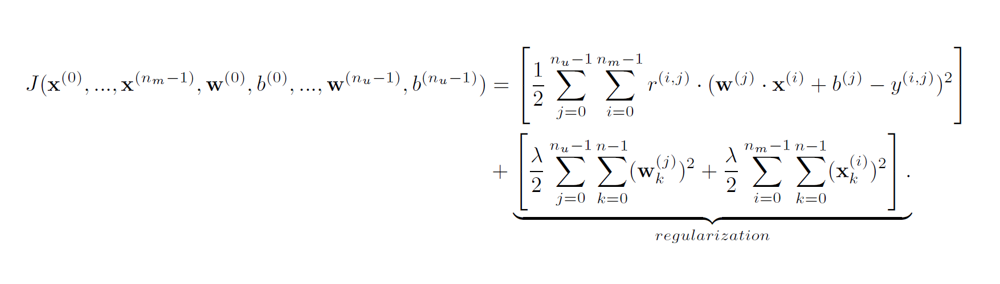

# Collaborative Filtering Recommender Systems

### Overview

This notebook implements a simple collaborative filtering recommender system using gradient descent and tensorflow. It is based on an exercise from the Coursera course: [Machine Learning Specialization from Andrew Ng](https://www.coursera.org/specializations/machine-learning-introduction).

### Movie ratings dataset

The data set is derived from the [MovieLens "ml-latest-small"](https://grouplens.org/datasets/movielens/latest/) dataset.   
[F. Maxwell Harper and Joseph A. Konstan. 2015. The MovieLens Datasets: History and Context. ACM Transactions on Interactive Intelligent Systems (TiiS) 5, 4: 19:1–19:19. <https://doi.org/10.1145/2827872>]

The original dataset has  9000 movies rated by 600 users. The dataset has been reduced in size to focus on movies from the years since 2000. This dataset consists of ratings on a scale of 0.5 to 5 in 0.5 step increments. The reduced dataset has 443 users, and 4778 movies. 

### Collaborative Filtering

We will implement the collaborative filtering learning algorithm and apply it to a dataset of movie ratings.
To train the model we need data that contains a set of movies and a set of users who have rated those movies. This can look like this:

|               | u1 | u2 | u3 | u4 |
| :------------ | ------------- | ------------- | ------------- | ------------- |
| m1 | 5             | 4             |               | 2             |
| m2 |               | 4             | 5             |               |
| m3 | 1             | 2             |               | 4             |
| m4 |               |               | 3             |               |
| m5 | 5             | 3             | 3             | 5             |

The cells can be empty, as users only rate a few movies. In the above example, User 1 gave movie 1 a rating of 5, but did not rate movie 2.

The goal of a collaborative filtering recommender system is to learn two vectors: For each user, a 'parameter vector' $\mathbf{w}^{user}$ that embodies the movie tastes of a user. For each movie, a feature vector $\mathbf{x}_{movie}$ of the same size which embodies some description of the movie. The dot product of the two vectors plus the bias term should produce an estimate of the rating the user might give to that movie. So one training example from the table above would be:
$\mathbf{w}^{(1)} \cdot \mathbf{x}^{(3)} + b^{(1)} = 1$.

The vectors $\mathbf{w}^{(i)}, \mathbf{x}^{(j)}$ must have the same length and it is a parameter of the model that is chosen before training. Let's say we choose the length as the number of different movie genres. One possible interpretation then could be, that each entry in the user vector $\mathbf{w}^{user}$ represents how much the user likes that genre and the respective entry in the movie vector $\mathbf{x}^{movie}$ describes how much that movie fits that genre.

### Implementation

We combine all user vectors and movie vectors into matrices $\mathbf{X}$, $\mathbf{W}$ and load the data set into a matrix $\mathbf{Y}$. We also create a binary-valued indicator matrix $\mathbf{R}$, where $\mathbf{R}(i,j) = 1$ if user $j$ gave a rating to movie $i$, and $\mathbf{R}(i,j)=0$ otherwise.

The cost function then is given by

The parameters  $\mathbf{X}$, $\mathbf{W}$, and $\mathbf{b}$ will be learned by a simple Gradient Descent.

### Recommendation

To predict the rating of movie $i$ for user $j$, you compute $\mathbf{w}^{(j)} \cdot \mathbf{x}^{(i)} + b^{(j)}$. This can be computed for all ratings using matrix multiplication. As recommendations you can then output e.g. the movies with best predicted ratings for that user.
